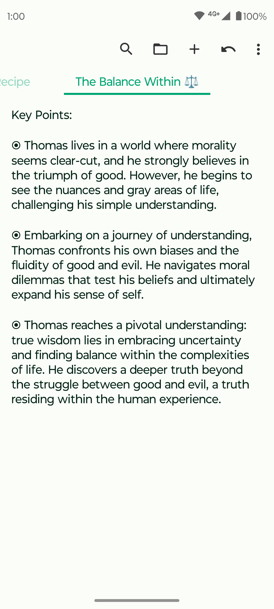
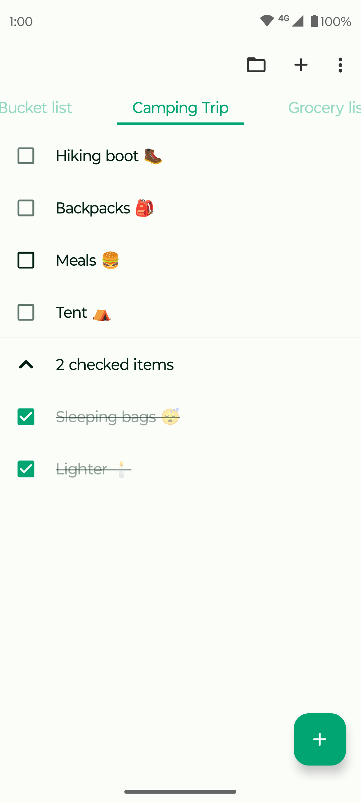
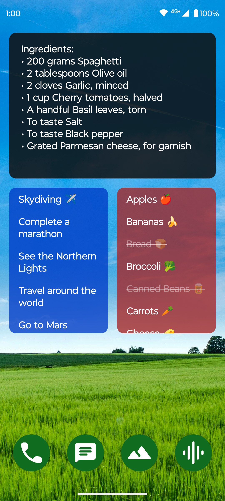

# Fossify Notes

Introducing Fossify Notes – your ultimate tool for effortless note-taking, organization, and planning. Simplify your life with this intuitive organizer designed to streamline your tasks and ideas effortlessly.

**🗒️ SIMPLE NOTE-TAKING:**  
Fossify Notes lets you quickly jot down shopping lists, address reminders, or brilliant startup ideas with just a tap. Say goodbye to clutter and hello to efficient note creation. No more fussing over complex setups.

**📋 REMARKABLE ORGANIZATION:**  
Stay on top of your duties with ease using Fossify Notes' simple-to-use organizer and colorful note-taking widget. Never forget crucial information or shopping lists again – it's all at your fingertips.

**💾 AUTOMATIC SAVING:**  
Forget about losing your work. Fossify Notes automatically saves your edits, ensuring that your changes are always preserved. Create multiple independent notes and lists effortlessly.

**🖼️ CUSTOMIZABLE WIDGET:**  
Access your lists and manage your to-do tasks in a flash with Fossify Notes' customizable widget. Enjoy seamless organization on the go with just a tap.

**🚫 AD-FREE AND PRIVACY-FOCUSED:**  
Enjoy a clutter-free experience with Fossify Notes – no ads or unnecessary permissions. Fossify Notes operates offline without internet permission ensuring a stable and secure environment for your notes.

**🔓 OPEN-SOURCE FREEDOM:**  
Fossify Notes is fully open-source, offering customizable colors and providing transparency and flexibility for users. Experience the freedom of customization and peace of mind with a community-driven note-taking solution.

Experience the simplicity and efficiency of note-taking with Fossify Notes. Download now and unlock the power of organized thinking.

➡️ Explore more Fossify apps: https://www.fossify.org 
➡️ Open-Source Code: https://www.github.com/FossifyOrg 
➡️ Join the community on Reddit: https://www.reddit.com/r/Fossify 
➡️ Connect on Telegram: https://t.me/Fossify

